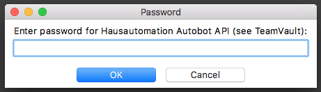
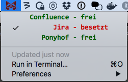

#  whereToGo  
WhereToGo Plugin for BitBar

Now you know where to go.
Shows if the toilet door is open or closed in your Mac menu bar.

#Install

##Step 1:
[Get the latest version of](https://github.com/matryer/bitbar/releases) (Download BitBar.zip). Copy it to your Applications folder and run it - it will ask you to (create and) select a plugins folder, do so.

##Step 2:
[Get the latest version of whereToGo](https://github.com/SaschaKrieg/whereToGo/releases) (Download whereToGoDistro.zip). Extract the zip file and copy the whereToGo.py and the whereToGo folder into your BitBar plugin folder.

##Step 3:
Start BitBar or if BitBar is already startet go to the menu and select refresh. WhereToGo request you to enter the password for the "Hausautomation Autobot API" (see TeamVault). The password is stored in the keychain of your Mac.  

##Step 4:
Choose your preferred location in the menu. 

The status of your choosen location will be displayed by the menu Icon.

*  you can go
*  Meeeh

#Further Configuration

##Refreshrate
You can configure the refresh rate. The refresh time is in the filename of the plugin, following this format:

    {name}.{time}.{ext}

  * `name` - The name of the file
  * `time` - The refresh rate (see below)
  * `ext` - The file extension

For example:s

  * `whereToGo.45s.py` would refresh every 45 seconds.

##Configfile
In the folder whereToGo is the configuration file named whereToGoConfig.json. Here you can specifiy the: 
* server settings
* the locations aka territories and the underlying Homematic sensor IDs
* the images used in the plugin